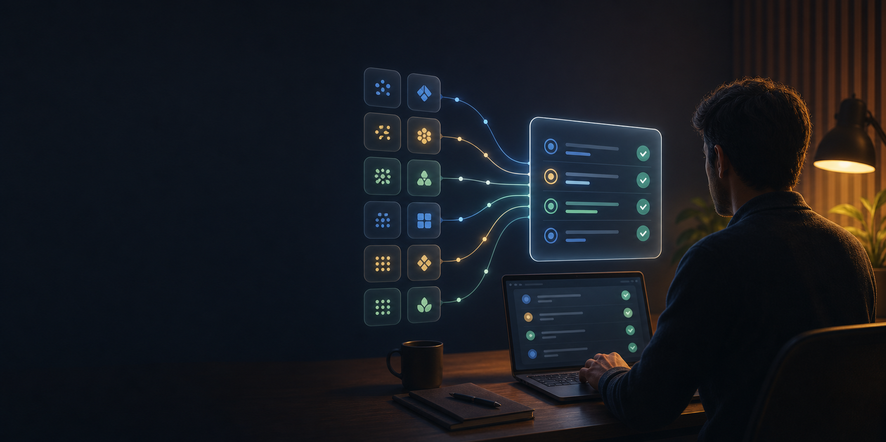
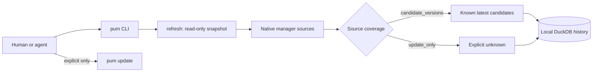

<p align="center">
  
</p>

<h1 align="center">pum</h1>

<p align="center"><strong>See what is stale. Choose what changes. Keep your dev machine yours.</strong></p>

<p align="center">
  Safe package health for humans and AI coding agents: one local Rust CLI, 12 package-manager adapters, durable version history, and zero silent upgrades.
</p>

<p align="center">
  <a href="https://github.com/Supersynergy/pum/releases"></a>
  <a href="https://github.com/Supersynergy/pum/actions"></a>
  <a href="LICENSE"></a>
</p>

> **The promise:** PUM tells you what is installed, what has a verified newer candidate, when that answer was checked, and which sources are still unknown. It never updates your OS and never changes packages until you explicitly run `update` or `self --apply`.

## Start here — 60 seconds to a truthful answer

```bash
pum refresh --json    # read-only: inventory + native source checks + DuckDB snapshot
pum status --json     # freshness, known newer versions, and source coverage
```

You get one stable contract for terminal, CI, and agents:

```json
{
  "stale": false,
  "latest_candidates": [{"name": "tool", "installed": "1.0.0", "latest": "1.1.0"}],
  "source_coverage": [{"manager": "brew", "mode": "candidate_versions"}]
}
```

`candidate_versions` means PUM queried that manager's non-mutating native source. `update_only` means PUM can inventory or update it, but does **not** yet know a safe package-level latest-version query. Unknown stays unknown — never silently rebranded as current.

| Need | Run | What stays safe |
|---|---|---|
| One current answer | `pum refresh --json && pum status --json` | Read-only |
| See only known upgrades | `pum report --outdated --json` | Read-only |
| Preview every package action | `pum update --dry-run --all` | Read-only |
| Apply the reviewed plan | `pum update --all` | Explicit mutation |
| Daily freshness | `pum schedule --install` | Read-only `refresh` at 09:05 on macOS |

## Why people use it

Modern dev machines have brew, npm, Cargo, uv, mise, gems, and more. Their separate output formats make one simple question surprisingly hard: **“What needs my attention, and can I trust that answer?”**

PUM turns that question into a small, inspectable loop:

1. Discover installed tools across the managers actually present on your `PATH`.
2. Query native read-only update sources where one exists.
3. Persist a timestamped DuckDB snapshot so “what changed since yesterday?” is answerable.
4. Preview first; mutate only when you say so.

No OS updates. No arbitrary shell hooks. No pretend certainty.

## Install

### Homebrew

```bash
brew install Supersynergy/pum/pum
pum doctor
```

### From source

```bash
git clone https://github.com/Supersynergy/pum
cd pum
cargo install --path apps/pum
pum doctor
```

Prebuilt, checksum-verified archives are published on the [Releases page](https://github.com/Supersynergy/pum/releases). Do not pipe a network installer into a shell; download an immutable release asset and verify its `.sha256` first.

## The useful paths

### For a human at the terminal

```bash
pum doctor                         # active managers on this machine
pum refresh                        # one read-only current snapshot
pum report --outdated              # clear installed → latest table
pum update --dry-run --all         # see every proposed command
# review the plan, then:
pum update --all                   # explicit upgrades only
```

### For an AI coding agent or CI job

```bash
pum status --json
# If stale is true, last_refresh is null, or current versions are required:
pum refresh --json
pum report --outdated --json
```

For third-party API work, do this *after* the local tool check:

```bash
freshdocs context "<task>" --project <project-root> --sync-stale
```

PUM answers **installed tool freshness**. Freshdocs answers the **current integration/API contract**. The PUM agent skill encodes this sequence and refuses to call an unsupported source “current.”

### For a repo

```bash
pum project . --json               # manifest dependency freshness
pum audit . --json                 # OSV.dev CVE/GHSA data and fixed versions
```

Global packages and project manifests are intentionally separate scopes. That keeps an agent from confusing “the globally installed CLI is current” with “this repository has safe dependencies.”

## What PUM knows today

| Manager | Latest-version source | Contract |
|---|---|---|
| Homebrew, npm, pnpm, Cargo, Rustup, RubyGems, mise | Each manager's native non-mutating outdated/check command | `candidate_versions` |
| bun, uv tools, pipx, Go binaries, gh extensions | Safe package-level resolver not wired yet | `update_only` / unknown |

PUM supports 12 adapters: brew, npm, pnpm, bun, uv, pipx, Cargo, Rustup, RubyGems, Go, mise, and GitHub CLI extensions. Only managers available on `PATH` activate.

## Durable local history, not surveillance

PUM stores its inventory in `~/.local/share/pum/inventory.duckdb` (or `$PUM_DB`) and keeps a JSON mirror for portability. Every `refresh` adds a run and package observations; `status --json` shows the database path and age. On first v0.2 startup, an old SQLite `inventory.db` imports once and remains untouched.

DuckDB fits local snapshot history and analytics. DuckLake does not: it adds catalog/object-storage machinery for shared lakehouses that a single-user local CLI does not need. `rusqlite` remains only for one-way legacy import.

## Safety boundaries

| PUM does | PUM deliberately does not do |
|---|---|
| Read package-manager metadata | Update macOS or trigger a reboot |
| Show source, timestamp, installed and latest candidate | Claim unknown sources are current |
| Persist local history in one DuckDB file | Send your package inventory to a PUM service |
| Preview upgrades before running them | Apply an upgrade without an explicit `update` command |

`scan`, `check`, `refresh`, `status`, `report`, `project`, and `audit` are read-only toward package installation. `schedule --install` schedules only `refresh --json`, never an update.

## Commands

```text
pum doctor                         managers available on PATH
pum scan                           inventory → DuckDB + JSON mirror
pum check                          native-manager upgrade candidates
pum refresh [--json]               scan + check + append-only snapshot
pum status [--json]                freshness, candidates, source coverage
pum schedule --install             daily 09:05 macOS read-only refresh
pum schedule --remove              remove that launchd job
pum report [--outdated] [--json]   human table or machine contract
pum update --dry-run --all         preview
pum update --all                   explicit package updates
pum self [--apply]                 show/apply supported manager self-updates
pum project [path] [--json]        project manifest dependencies
pum audit [path] [--json]          OSV vulnerability lookup
```

## Architecture



## Development and release

```bash
just ci
cd apps/pum && cargo build --release
```

See the [audit](docs/AUDIT_2026-07-23.md), [spec](docs/SPEC.md), [changelog](CHANGELOG.md), and [release contract](docs/RELEASE.md). A public tag requires tests, strict Clippy, Cargo Deny, migration smoke tests, pinned CI actions, and immutable-artifact verification.

## Security, contribution, license

[Security policy](SECURITY.md) · [Contributing](CONTRIBUTING.md) · [MIT License](LICENSE)
