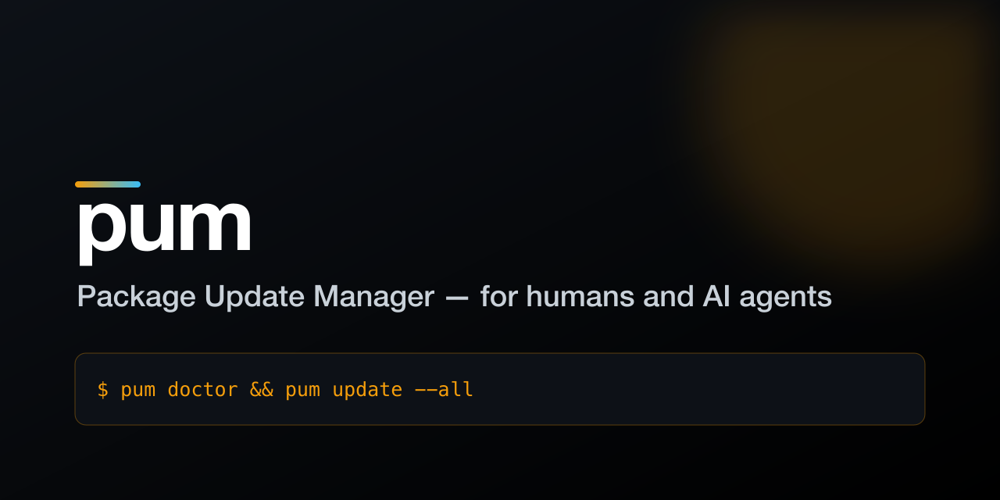
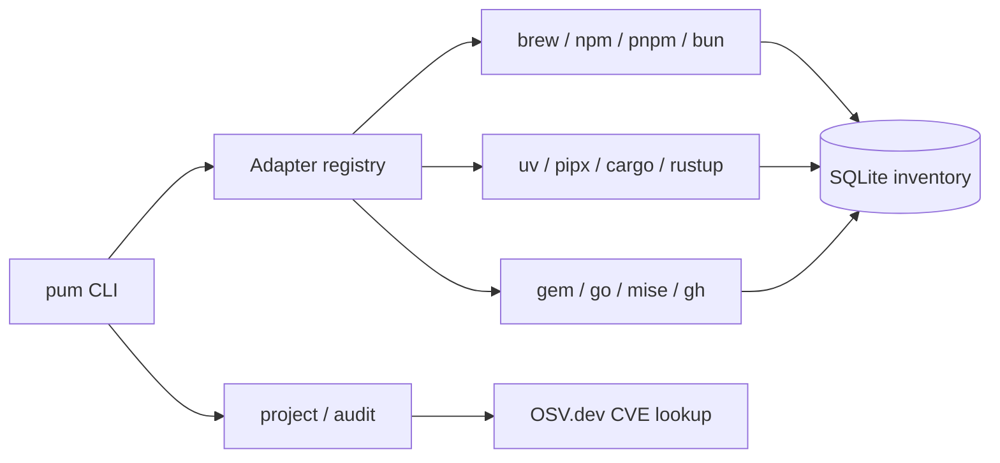

<p align="center">
  
</p>

# pum — Package Update Manager

> Unified update manager for humans and AI coding agents — one static Rust binary,
> 12 package-manager adapters, `--json` on every command so agents parse it without scraping text.

[](https://github.com/Supersynergy/pum/releases)
[](LICENSE)
[](https://github.com/Supersynergy/pum/actions)

[Changelog](CHANGELOG.md) · [Spec](docs/SPEC.md) · [Releases](https://github.com/Supersynergy/pum/releases) · [Issues](https://github.com/Supersynergy/pum/issues)

> **Safe by default:** `pum` only looks. `scan`, `check`, `report`, `project`, and `audit`
> never change anything on your machine. Only `update`/`self --apply` install upgrades —
> and only for the manager you name. Nothing is ever silently upgraded.

## Demo

```
$ pum doctor && pum check && pum report --outdated
```


## Why

Every machine running more than one package manager (brew + npm + cargo + uv...) needs
one place to ask "what's outdated" and "is any of this vulnerable" — without shelling
out to twelve different tools with twelve different output formats. `pum` gives both a
human at a terminal and an AI agent driving that terminal the same single, scriptable
answer. It's also the tool an agent should run *before* touching a repo's dependencies:
`pum project` and `pum audit` catch outdated/vulnerable manifest deps that the global
adapters never see.

### vs. topgrade / mise

`pum` is a narrower tool than either — it doesn't manage dev-tool *versions per project*
(that's mise) and it doesn't run arbitrary shell hooks or update the OS (that's topgrade,
deliberately). It's the one that answers "what's outdated/vulnerable" in a format a
script or an AI agent can consume directly.

| | pum | topgrade | mise |
|---|---|---|---|
| Language / runtime dep | Rust, none | Rust, none | Rust, none |
| Scope | packages & dev tools only | packages + OS + configs | per-project tool versions |
| `--json` output | every read command | no | partial |
| Project-manifest CVE audit | yes (`pum audit`, OSV.dev) | no | no |
| OS updates | never (by design) | yes, optional | n/a |
| Inventory database | yes (SQLite, queryable) | no | no |

## Features

| Feature | Why it matters |
|---|---|
| 12 adapters (brew, npm, pnpm, bun, uv, pipx, cargo, rustup, gem, go, mise, gh) | One command instead of twelve; only managers present on `PATH` activate |
| `--json` on every read command | Agents and CI parse structured output, never scrape a table |
| `pum project` / `pum audit` | Scans a **repo's own** manifest deps (not just global installs) and flags CVEs via OSV.dev |
| SQLite inventory, status-preserving upsert | `scan` never wipes a prior `check` result; multiple installed versions of one tool persist |
| Single static binary, zero runtime deps | Doesn't depend on the Python/Node runtimes it's meant to update |
| Packages & dev tools only, by design | No OS updater adapter — `pum` never triggers a reboot |

## Quick Start

No Rust toolchain needed — prebuilt binary via shell installer:

```bash
curl --proto '=https' --tlsv1.2 -LsSf https://github.com/Supersynergy/pum/releases/latest/download/pum-installer.sh | sh
pum doctor                      # which managers are live on this machine
```

Or from source:

```bash
git clone https://github.com/Supersynergy/pum
cd pum
cargo install --path apps/pum   # → ~/.cargo/bin/pum
```

Expected result: a table of the managers found on your `PATH`, each marked `live`.

## Usage

```bash
pum doctor                 # which managers are live
pum scan                   # inventory all installed packages → SQLite + JSON
pum check                  # find outdated packages (queries each manager)
pum report                 # print table (installed vs latest)
pum report --outdated --json
pum update --dry-run --all # preview upgrades (mutates nothing)
pum update --manager brew  # upgrade one manager's packages
pum self                   # show manager self-update commands
pum self --apply

pum project [path]         # outdated PROJECT deps (package.json/Cargo.toml; default cwd)
pum project --json         # machine-readable (deprecated packages flagged [deprecated])
pum audit   [path]         # CVE/GHSA scan via OSV.dev (severity + fix version)
pum audit   --json         # machine-readable advisories for CI gates
```

> `scan`/`check` cover **globally** installed tools. `project`/`audit` cover a **repo's
> own dependencies** (the manifest) — the two scopes are intentionally separate.

Inventory DB: `$PUM_DB` or `~/.local/share/pum/inventory.db` (+ `inventory.json` mirror,
written on every `pum scan`).

## Architecture



Dev via `just` (runs from source):

```bash
just build · just doctor · just scan · just check · just report --outdated · just test · just ci
```

## Why Rust

pum updates Python tooling (uv, pipx) — a Python implementation would depend on the very
runtime it manages. A self-contained Rust binary has zero runtime deps, matching the
direct peers (topgrade, mise, uv). See [CHANGELOG.md](CHANGELOG.md) (Python v0 → Rust port).

## Requirements

Rust 1.96+ (edition 2024, pinned in `apps/pum/rust-toolchain.toml`) to build · zero
runtime deps once built (single static binary). Adapters auto-activate only for
managers present on your `PATH`.

## Development

```bash
cd apps/pum
cargo test
cargo clippy --all-targets -- -D warnings && cargo fmt --check
cargo deny check
```

## Release

See [CHANGELOG.md](CHANGELOG.md) and [Releases](https://github.com/Supersynergy/pum/releases).

## Security

Report vulnerabilities privately. See [SECURITY.md](SECURITY.md).

## Contributing

See [CONTRIBUTING.md](CONTRIBUTING.md).

## License

[MIT](LICENSE) © Maxim M.
